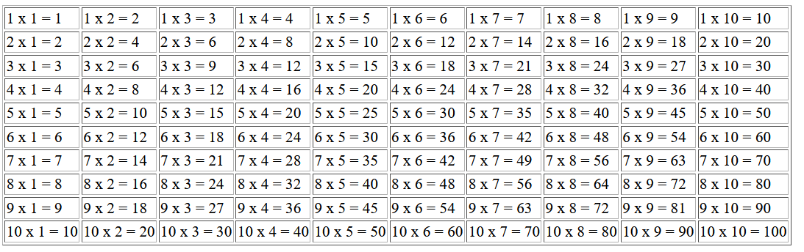

# Υπλογισμός προπαίδειας με PHP σε πίνακα HTML
Να υλοποιηθεί πρόγραμμα σε php το οποίο να υπολογίζει την προπαίδεια με nested for loop (δηλ. loop μέσα σε loop).  Το τελικό αποτέλεσμα θα έχει την παρακάτω μορφή.




ΛΥΣΗ:
-----
```php
<html>
<head>
	<title>Dynamic Table using PHP</title>
</head>
<body>

<?php
$rows = 10;
$cols = 5;

echo "<table border=\"1\">";

for ( $i = 1; $i <= $rows; $i++ ) 
{ 
	echo "<tr> \n"; 
	for ($k=1; $k <= $cols ; $k++) 
	{ 
		$r = $i * $k;
		echo "<td>$i x $k = $r</td>";
	}
	echo "</tr>";
} 

echo '</table>';
?>

</body>
</html>
```
